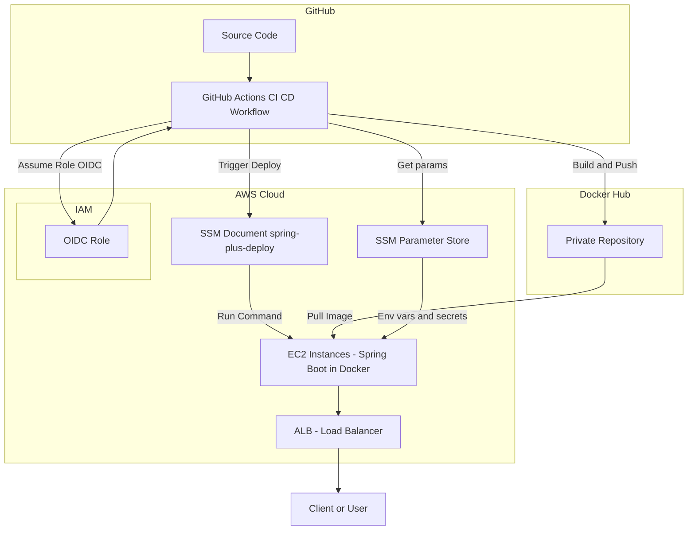

# Spring Plus

[](https://adoptium.net/temurin/releases/)
[](https://spring.io/projects/spring-boot)

[](https://gradle.org/)
[](https://www.mysql.com/)
[](https://www.h2database.com/)
[](https://jwt.io/)
[](https://querydsl.com/)

## ☁️ AWS 서비스 설정

- [EC2 Instance](docs/ec2.md)
- [EC2 ALB](docs/alb.md)
- [RDS](docs/rds.md)
- [S3](docs/s3.md)
- [OIDC](docs/oidc.md)
- [Parameter Store](docs/parameter-store.md)

## ♾️ CI/CD Pipeline

- [📘 블로그에서 CI/CD 구축 과정 보기](https://younghunkimm.github.io/posts/cicd-pipeline-1/)
- [GitHub Actions Workflows](.github/workflows/)


## 조회 속도 개선

- [PR Link](https://github.com/younghunkimm/sparta-spring-plus/pull/64)

## 🧰 기술 스택

- 언어/런타임: Java 17
- 프레임워크: Spring Boot 3.3.3 (Web, Data JPA, Security, Validation, Actuator)
- 데이터베이스: MySQL (H2 Runtime 의존성 포함)
- 보안/인증: JWT (jjwt), BCrypt
- 데이터 접근: QueryDSL (Jakarta)
- 클라우드: Spring Cloud AWS (S3)
- 빌드: Gradle Wrapper

## 📚 프로젝트 개요

회원 인증(JWT), 사용자 관리, Todo 관리(작성/목록/상세/검색), 파일 업로드(S3 Presigned URL), Todo 매니저 관리 등 실무 기능을 담은 Spring
Boot 3 기반 서버
애플리케이션입니다. 로컬/운영 프로필을 분리하고, 확장 가능한 도메인 구조를 채택했습니다.

## 🚀 주요 기능

- 회원가입/로그인 및 JWT 발급
- 사용자 정보 조회, 비밀번호 변경, 프로필 이미지 파일키 업데이트/조회
- 관리자 권한으로 사용자 역할 변경
- S3 Presigned URL 발급(업로드/다운로드)
- Todo 생성, 목록/상세 조회, 조건 검색
- Todo 매니저 등록/조회/삭제

## 🧩 핵심 도메인

- Auth: 회원가입/로그인, 토큰 발급
- User: 사용자 정보, 비밀번호/프로필 관리
- Admin(UserAdmin): 사용자 권한 변경(ADMIN)
- File: S3 Presigned URL 발급 및 파일키 관리
- Todo: 생성, 목록/상세 조회, 조건 검색
- Manager: Todo 담당자(매니저) 관리
- Log: 요청/비즈니스 로그 기록
- Common: 공통 예외/인증 컨텍스트 등 기반 구성

## 📘 API 명세 요약

### Auth

```http
POST /auth/signup                # 회원가입
POST /auth/signin                # 로그인
```

### User

```http
GET /users/{userId}              # 사용자 조회
PATCH /users/profile             # 프로필 이미지 파일키 변경
GET /users/profile               # 프로필 이미지 조회
PUT /users                       # 비밀번호 변경
```

### Admin

```http
PATCH /admin/users/{userId}      # 사용자 권한 변경
```

### File

```http
POST /files/presigned/upload     # 업로드용 Presigned URL 발급
POST /files/presigned/download   # 다운로드용 Presigned URL 발급
```

### Todo

```http
POST /todos                      # Todo 생성
GET /todos                       # Todo 목록 조회
GET /todos/{todoId}              # Todo 단건 조회
GET /todos/search                # Todo 검색 (관계 카운트 포함)
```

### Comment

```http
POST /todos/{todoId}/comments    # 댓글 등록
GET /todos/{todoId}/comments     # 댓글 목록 조회
```

### Todo Manager

```http
POST /todos/{todoId}/managers    # 매니저 등록
GET /todos/{todoId}/managers     # 매니저 목록 조회
DELETE /todos/{todoId}/managers/{managerId}   # 매니저 삭제
```

## 🗂️ 프로젝트 구조

```text
src/
├─ main/
│  ├─ java/
│  │  └─ org/example/expert/
│  │     ├─ aop/
│  │     ├─ client/
│  │     ├─ config/
│  │     └─ domain/
│  │        ├─ auth/
│  │        ├─ user/
│  │        ├─ manager/
│  │        ├─ todo/
│  │        ├─ file/
│  │        ├─ comment/
│  │        ├─ log/
│  │        └─ common/
│  └─ resources/
└─ test/
   ├─ java/
   │  └─ org/example/expert/
   │     ├─ config/
   │     ├─ domain/
   │     └─ support/
   └─ resources/
```

## 🧱 도메인 세부 구조

```text
src/main/java/org/example/expert/domain/
└─ user/
   ├─ controller/
   ├─ service/
   ├─ repository/
   ├─ entity/
   ├─ enums/
   └─ dto/
      ├─ request/
      └─ response/
```
